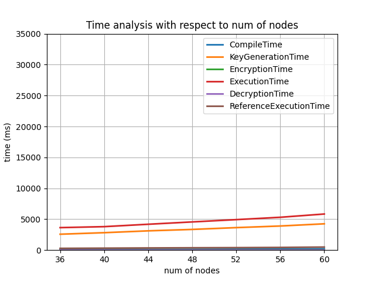
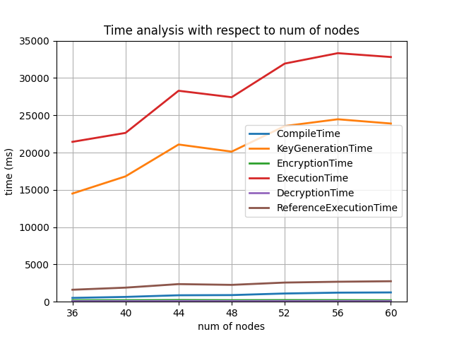
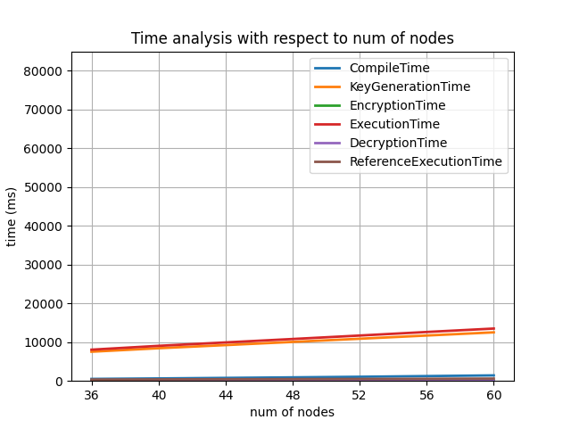
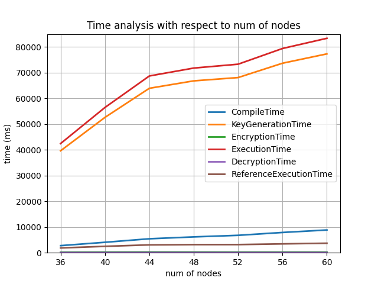
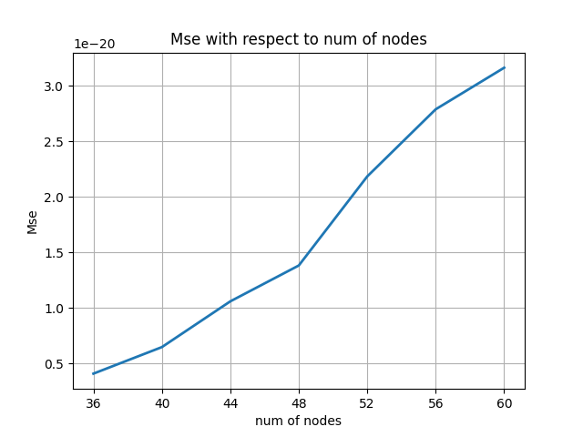
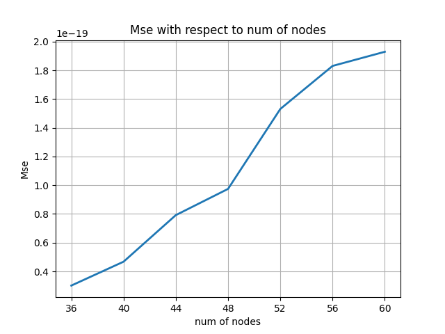
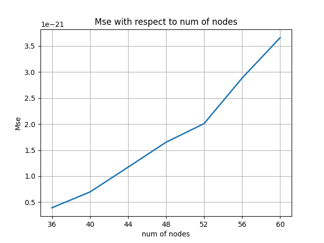
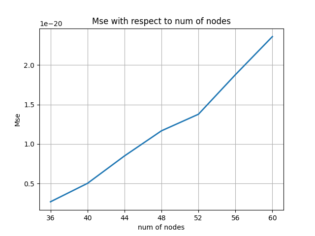
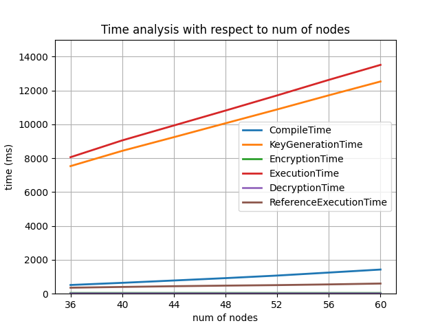
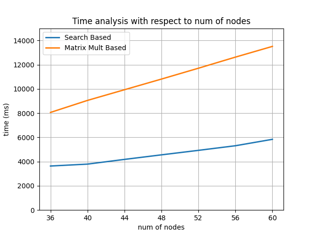

Homomorphic Encryption (HE) became a requirement for secure and private outsourced computation of concealed sensitive data. Although it provides privacy, it comes with an inevitable heavy load. Briefly, the workflow of HE is encrypting sensitive data which will be used in outsourcing computation without decoding and decrypting the result of the computation. In this study, CKKS, which is an approximate homomorphic encryption scheme, is used for computation. Graphs are used in numerous manners in computer science from connectivity of people in a social medium to representation of molecules. For the cases where the input is sensitive like the topology of person’s related people or the topology of GSM stations, sending the connectivity information without encryption is a vulnerability. On the other side, analysis on a server is demanded. For instance, a GSM cluster desires to compute availability check of each node and a node knows only its’ neighbour nodes. There should be a server that receives parts of the graph from nodes and computes connectivity. In such case, each graph encrypts its adjacency for sending to server and server checks the connectivity. There are various circumstances parallel to the instance. This study aims to compute the number of non-connected nodes for a homomorphically encrypted non-directed graph. I present two approaches, namely search-based and path length-based, and analysis for them. For each approach, analysis mainly includes different topologies and computation time for HE processes. This study also proposes interfaces for client and server since overall computation requires large scales of polynomials.

Introduction
============

Outsource computation and distributed computation are attracting attention with the demand from many field from medicine to communication. The main concern is confidentiality of the data. For instance, revealing one’s healt status or disease makes attackers motivate to abuse that information. At the first sight, reveal of the information is not ethical, but, the information may be used to sell medicament or for the worser cases, it allows threathening the owner of information. Examples have a wide range for various sensitive data such as topology of network, trained machine learning model, dataset of machine learning.

Homomorphic Encryption (HE) is designed to protect privacy of the sensitive data. It provides user to perform computations without decrypting it. At the first step, the data is encrypted with the public key of the user so that receiver can authenticate the sender and can not decrypt the data. At the server side, computation are performed and result is returned encrypted. When the owner receives the result, it can be decrypted with private key. While there are exact and approximate approaches of HE @review, CKKS @CKKS, an aproximate polynomial based scheme, is used for encrypted operations.

In this work, a graph algorithm to process encrypted adjacency list is examined. To motivate, graph algorithms have wide range of usage that can be listed as: financial services, manufacturing, data regulation, marketing and machine learning @oracle. Number of non-reachable node (NoNRN) problem is the main concern of the paper. Note that, this problem is a generic approach as it does not depend any specific domain. On the other side, it has multiple overlapping solutions with other graph algorithms that is solving a graph problem is correlated with solving others.

A crucial point to notice is CKKS does not provide some basic logic operations. First, comparison can not implemented in CKKS which is commonly used in graph algorithms to branch and terminate. CKKS lacks indexing which is intuitive from safety and privacy point. Graph algorithms also use indexing in order to mark visited nodes, get neighbours of a desired node.

In the scope of this work, above issues are solved by communication with client via secure interface. Simply, server handles a step and client slightly modifies the result and resends it. Doing so the algorithm become less secure but otherwise algorithm suffer from two hardship. One is running N , number of nodes, many iteration in a graph analytic program exploits the required bit, which results in bit modulus error. The second is since there is no comparison, server can not early terminate the computation. Moreover, I provide two analysis as execution times of one run of N runs and execution times of cummulative runs.

Miscrosoft Seal @sealcrypto is hired for HE library and Microsoft EVA @Eva compiler for HE which provides a Python wrapper is hired for simulating the algorithm and encryptions.

Main points are:

-   Algorithms for a graph problem, namely number of non-connected nodes, with HE

-   Trade offs for two approaches

-   Communication interface and analysis with it

A Distributed Algorithm Example
-------------------------------

An example distributed algorithm for broadcasting on an undirected graph is presented in Algorithm [alg:blindflooding].

[1]

Background and Related Work
===========================

Background
----------

This section provides the background information.

Related Work
------------

**Homomorphic Encryption** has gained more emphasis. Munjal et al. published a review on HE please see for detailed explanation of HE and state of the art methods @2022_rev. Louis et al. conducted a review for machine learning methods @2015_rev. There are considerably high works on medicine since the data privacy is crucial. Wood et al. provided a newer review of HE for medicine and machine learning @medicine_rev. In @medicine1, Froelicher et al. proposed novel federated analysis of medical data and they discussed how separate parts can contribute to computation.

**Counting the number of non-connected nodes of a node** has multiple solutions. It can be solved with depth first search, breath first search and finding paths with length 1 to N, where N is the number of nodes in the graph.

To the best of my knowledge, there is no work on homomorphical graph search algorithm which handles all search operations in server. Nevertheless, matrix multiplication algorithms have attracked the attention from machine learning community@eff_matmul.

Main Contributions
==================

Search Based Approach
---------------------

[H]

[1]

$mask = [0.0] cdot vecLength$ $mask[row] = 1$ $mask = mask cdot graph$ $mask = mask + (mask >> i)$ for i in range(0, $N/2$)

$allMasks gets emptyset$ $allMasks = allMasks + GetMask(row)$ for row in range(0, N) $filteredNeighbour gets allMasks cdot graph$

$reval gets emptyset$ $fNeighbours gets FilteredNeighbours(graoh)$ $reval = reval + (fNeighbours << (Ncdot k))$ for k in range (1, N)

Matrix Multiplication Based Approach
------------------------------------

In this section, I present client-side operations of matrix multiplication based approach which is highly similar to client-side of the previous search based approach. Matrix multiplication psuedocode is not given here but implemented in the code. For details of homomorphic efficient matrix multiplication, please see @eff_matmul.

[H]

[1]

**If** $graph(i) > 0.7$:

$graph(i) = 1$ **Else**:

$graph(i) = 0$

$graph gets Serialize(graphAsAdj)$ $oldHead gets emptyset$

$graphEnc gets Encrypt(graph)$ $retval gets OneStep(graphEnc)$ **If** $OneStep()$ is $BFSHeadOneStep()$:

$retval gets Stabilize(retval)$ **If** not $ {CheckChange(retval, oldHead)}$ :

**Return $CountNonConnected(retval)$** $oldHead gets retval[:N]$

Results and Discussion
======================

Methodology
-----------

Number of non-connected nodes problem has multiple solution as mentioned earlier. The following sections explain details of approaches. Number of non-connected nodes will be denoted as NoNCN.

To define the problem I state given a graph $mathcal{G}$ with non-directed edges between $mathcal{N}$ nodes, adjacency matrix is $mathcal{A} in mathcal{R}^{mathcal{N}timesmathcal{N}}$, where $mathcal{A}_{i,j}$ denotes the connection between $mathcal{N}_i$ and $mathcal{N}_j$.

### Search Based Homomorphic NoNCN {#sec:Search}

The most general and the simplest approach is traversal approaches starting from the head node. During traversal mark the nodes encountered in the visited list which initialized all False’s. Consequently return the number of False’s in the visited list. Apart from classical solution, homorphic twin of this solution will be presented. To see overall approach please see [alg:search]. Note that HE keeps the polynomial form of the graph and there can not be separate visited list. In order to solve that, adjacency list itself modified such that row of the head node (first node) is the visited list.

The method starts with creating masks $mathcal{M}_i$ for each node $i$. Since there is no comparison, $mathcal{A}_{0,i}$ is detected by indicator vector $indic$. Indicator is $[0 .. 0] in mathcal{R}^{16384}$, where $16384$ is the vector size of encrypted message, vector with only one element $indic_i = 1$, as I create $i^{th}$ node’s mask. Multiplication of $indic$ and $graph$ gives the vector of $indic$ back or all zeros with respect to $mathcal{A}_{0,i}$. Consequently, I get a vector with one element is $1$ or not. In order to create the mask from that, I used shifted sums. In case $mathcal{A}_{0,i} = 0$ since $indic = [0 .. 0]$, shifted sum is also $0$ vector. In case $mathcal{A}_{0,i} = 1$, $mathcal{M}_i = 1$ and it is shifted $frac{mathcal{N}}{2}$ times while at each time it is summed with it’s previous version. An simplified example [eq:shiftedSum], i.e. without padding $0$s up to $16384$:

$$begin{aligned}
label{eq:shiftedSum}
    mathcal{M}^0_i &= [1, 0, 0, 0]  \
    mathcal{M}^1_i &= [1, 0, 0, 0] + [0, 1, 0, 0] = [1, 1, 0, 0] \
    mathcal{M}^2_i &= [1, 1, 0, 0] + [0, 0, 1, 1] = [1, 1, 1, 1]end{aligned}$$

$mathcal{M}^k$ defines the $k^{th}$ time of shifting and vector is shifted to left $2^k$. However if $mathcal{N} neq 0$ $mod(2)$, mask can not be computed as $1$s with shifted sums. The restriction comes from a step ahead. At the next step of algorithm, all generated masks are summed, thus, each mask should only affect its row in $mathcal{M} in mathcal{R}^{mathcal{N}times mathcal{N}}$. Again, an simplified example [eq:shiftedSum1] is given where $mathcal{N} = 5$:

$$begin{aligned}
label{eq:shiftedSum1}
    mathcal{M}^0_i &= [1, 0, 0, 0, 0]  \
    mathcal{M}^1_i &= [1, 0, 0, 0, 0] + [0, 1, 0, 0, 0] = [1, 1, 0, 0, 0] \
    mathcal{M}^2_i &= [1, 1, 0, 0, 0] + [0, 0, 1, 1, 0] = [1, 1, 1, 1, 0] \
    mathcal{M}^3_i &= [1, 1, 1, 1, 0] + [0, 1, 1, 1, 1] = [1, 2, 2, 2, 1] \end{aligned}$$

At the third step $mathcal{M}^3_i$, in order not to affect other domains, instead of shifting $2^3$, it is shifted to left as $mathcal{M}^2_i >> 1$.

All masks are computed separately. Note that each mask starts from $i^{th}$ location and after mask computation it occupies a range from $i$ to $i+mathcal{N}$. Before summation, each mask is shifted to the appropriate position in $mathcal{M}$. That is, $i^{th}$ mask is shifted from $(i, mathcal{N}+i)$ to $(icdot mathcal{N}, icdot mathcal{N} + mathcal{N})$.

At this point, notice that this method is close to matrix multiplication. This paragraph shortly explains that. Since the graph is non-directed, its adjacency matrix is a symmetric matrix. Thus, $mathcal{A} = mathcal{A}^T$. Masks $mathcal{M}$ corresponds to multiplying each row with the corresponding column. As a result, it seems like row by row element multiplication, but, it is identical to row by column multiplication.

After multiplication, filtered neighbours $mathcal{F} = mathcal{M} cdot mathcal{A}$ is computed with one missing operation. Essentially, it is computing the head’s row of matrix multiplication. All rows of multiplication is shifted left so that they overlap with the first row and summed. Overall example is given below.

$$begin{aligned}
 mathcal{A}^0 = begin{bmatrix}  0 & 1 & 0 \  0 & 0 & 1 \ 1 & 0 & 0 end{bmatrix} 
 & mathcal{M} =  begin{bmatrix} 0 & 0 & 0 \ 1 & 2 & 1 \ 0 & 0 & 0 end{bmatrix}\
 mathcal{A}cdot mathcal{M} &= begin{bmatrix} 0 & 0 & 0 \ 0 & 0 & 1 \ 0 & 0 & 0 end{bmatrix} \
 (mathcal{A}cdot mathcal{M})_{shifted} &= begin{bmatrix} 0 & 0 & 1 \ 0 & 0 & 0 \ 0 & 0 & 0 end{bmatrix} \
 mathcal{A}^1 &= begin{bmatrix}  0 & 1 & 1 \  0 & 0 & 1 \ 1 & 0 & 0 end{bmatrix} end{aligned}$$

$mathcal{A}^1$ is the one step of homomorphic algorithm. Client communication is discussed under [sec:CSI].

### Matrix Multiplication Based Homomorphic NoNCN

NoNCN problem can be seen as finding paths whose length are from $1$ to $mathcal{N}$. Finding such paths, neigbhour of the head node is all reachable nodes from the head. Section starts with the classical formulation of the paths of length $1$ to $i$. Then, homomorphic approach will be explained. Same notation with [sec:Search] will be used.

Power $i$ of an adjacency matrix computes paths of length $i$. $$begin{aligned}
    mathcal{A}^i = mathcal{A}^{i-1} times mathcal{A}^0end{aligned}$$

However, this form computes the paths of length exactly $i$. In order to compute paths of length from $1$ to $i$, adding self connections at each step to the $mathcal{A}$ is enough. Doing so, $mathcal{A}^0$ connections also preserverd in the $mathcal{A}^i$. Consequently, the overall idea has such a simple structure.

$$begin{aligned}
    mathcal{A}^i = (mathcal{A}^{i-1} + mathcal{I}) times mathcal{A}^0end{aligned}$$

Homomorphic matrix multiplication is proposed at @eff_matmul. It is not duplicated here and treated as a close method since algorithm itself requires long explanation and formulation. At each step, identity is added to the given graph and multiplied with itself. This result is returned to the client. As can be understood, classical version and the homomorphic version has tight relation. However, one more implementation detail is inserted to the matrix multiplication. In the cited work, vectors of the homomorphic program is given as $mathcal{A} in mathcal{R}^{mathcal{N}^2}$, i.e. in the size of adjacency list in this paper’s scope. Unlike proposed method, $16384 = 4096 times 4$ is picked for this project as safe margin. The issue reveals from the rotation operations of the proposed matix multiplication. Adjacency matrix is duplicated and shifted $mathcal{N}^2$ to right, then added to the original graph vector in order to handle rotations. Note that rotations for the matrix multiplication are saturated, nevertheless, there are trash values at the end of graph vector. These values are affordable since all operations are left rotation or can be transformed to left rotation in the matrix multiplication. On the other pass, when client resends $mathcal{A}^i$, garbage values are cleared on the server side.

### Client-Server Interface {#sec:CSI}

Two approaches explained above both having their own issues. In this section, interface for matrix multiplication based will be mentioned earlier and followed by search based method issues.

Matrix multiplication for one pass includes multiplications in itself that increases programs *bit modulus*. *Bit modulus* is the required bits to find a prime number $p$ $mod$ $2N = 1$. Multiplication which increases depth of the program increases the required bit. A few more discussion is included at [sec:ImpDet]. This issue is common for both approaches since both depends $N$ many times looping. As a solution, one step computed graph is returned at the end of each step. Client checks whether the head node $mathcal{A}_0$ is changed or not. If client does not decide to stop, it resend the graph to the server to compute the a step further paths.

Search based approach has another issue, namely numerical explosion. As can be seen at [sec:Search], masks may have greater numbers than $1$ and there are $mathcal{N}$ many multiplication. At the end, all rows are summed. Thus, small numerical deviations gets bigger. Also, CKKS can not maintain such deviations under control and $0$ values diverges to the higher values. Therefore, client maps each values to 1 and 0 at the end of each pass. That is the only difference from the matrix based interface.

### Implementation Details {#sec:ImpDet}

In this section implementation details namely scaling settings and multi core implementation will be investigated.

Apart from all the discussions above input and output scales takes significant role. Input scales are increased to take bit modulus under control. Notice that larger input scales implies a larger noise budget, hence more encrypted computation capabilities which is commented in the code of SEAL @sealcrypto.

Another point on the scaling is ’lazy_relinearize’ config in the porvided code template. Dividing code in to the functions may force lazy relinearization to relinearize the outputs of the functions. Thus, methods are divided into as many meaningful functions as possible. That solved bit modulus errors.

### Discussion on Approaches {#sec:disc}

Search based approach runs faster since it does not consider remaining rows other than the head node. It fulfills the remaining adjacency graph $mathcal{A}^k_{i neq 0}$ with trash values as it uses $mathcal{A}^0$ without caring other than head. Thus, it seems more secure.

On the other side, if one needs a number of non-connected graphs for all nodes matrix multiplication based approach seems valuable. It is slower than former approach and returns paths for all nodes. That makes it less secure, however, desirable choice for some tasks.

Results
-------

Experiments are run on graphs $mathcal{G}$ with $mathcal{N} in [36, 60]$. For each node count, 100 experiments are conducted. Measured variables are CompileTime, KeyGenerationTime, EncryptionTime, ExecutionTime, DecryptionTime, ReferenceExecutionTime and Mse. Most of the variables does not give clear idea since they take short time. However, ExecutionTime gives valuable sights. On the other hand, Mse does not variates since client stabilizes results before resending.

.5 {width=".9linewidth"}

.5 {width=".9linewidth"}

At the figure [fig:Totalvsone], the scaling between total (b) time and one pass (a) time is relatively small. This is the benefit of early stopping. Otherwise, time scales with the $mathcal{N}$. This case holds for the matrix multiplication at [fig:Totalvsone_mm].

.5 {width=".9linewidth"}

.5 {width=".9linewidth"}

[p] At [fig:Totalvsone] and [fig:Totalvsone_mm], it is seen that ExecutionTime and KeyGenerationTime are steady (even decreases in some cases). This is an interesting result. That may be resulted from probability of having edge ($p=0.05)$ while generation of graph is kept constant during tests. Therefore, having more nodes means the probability of reaching maximum connection is faster since there are more nodes with the same probability of having edge. As a result, lines gets steadier as the $mathcal{N}$ increases. The varianced version of the plots are also investigated, yet, they are not presented since plots become unreadable. This is a drawback of early stopping. In case the graph $mathcal{G}$ generated more linear, required pass increases with the linearity of the graph. Consequently, variance rises when this kind of graphs are created.

The MSE plots are given here but does not implies a lot. As expected the same attitude with other variables is hold in MSE plots. Linearity can be seen from the figures. Opposite to the early stopped times, MSE slope rises with the increasing number of nodes. This is also expected since multiplications and additions focus larger areas and the number of $0$s in the serialized vector given to the graph analitic program decreases.

.47 {width=".9linewidth"}

.47 {width=".9linewidth"}

.47 {width=".9linewidth"}

.47 {width=".9linewidth"}

{width="0.7linewidth"}

At the [fig:bigOne], which is a closer look to [fig:Totalvsone_mm], linearity is more obvious. Indeed, the increase is consistent, unlike total cases. As a result, the former guess on probability of having edges at [p] looks right. Lastly, Matrix Multiplication and Seach Based methods compared at [fig:comp]. Clearly, Matrix Multiplication Based approach starts with more time consumption and the ratio of that consumption swells with the increase of nodes.

{width="0.7linewidth"}

Discussion
----------

The main discussion is clearified at [sec:disc]. Client side operations make approaches weaker in the security view. Stabilization of the numbers for Search Based approach may be done at the server. Rescaling methods may be revisited to relinearize the one pass in the server so that all loops can be done at server. More experiments can be conducted with different having edge probability $p$ and comparison between approaches can be investigated further.

Conclusion
==========

In this report, a graph algorithm, namely number of non-connected nodes, is investigated. The homomorphic methods are proposed and discussed in terms of weaknesses and performance. Further directions are brought on the table.

About Appendices
================

Appendices should contain detailed proofs and algorithms only. Appendices can be crucial for overlength papers, but are still useful otherwise. Think of appendices as random-access substantiation of underlying gory details. As a rule of thumb: (1) Appendices should not contain any material necessary for understanding the contributions of the paper. (2) Appendices should contain all material that most readers would not be interested in  @Widom2006.

Assessment
==========

Your report will be assessed based on the following list of criteria.

Style
-----

[15 points] The report states title, author names, affiliations and date. The format follows this style?

1.  Structure and Organization: Does the organization of the paper enhance understanding of the material? Is the flow logical with appropriate transitions between sections?

2.  Technical Exposition: Is the technical material presented clearly and logically? Is the material presented at the appropriate level of detail?

3.  Clarity: Is the writing clear, unambiguous and direct? Is there excessive use of jargon, acronyms or undefined terms?

4.  Style: Does the writing adhere to conventional rules of grammar and style? Are the references sufficient and appropriate?

5.  Length: Is the length of the paper appropriate to the technical content?

6.  Illustrations: Do the figures and tables enhance understanding of the text? Are they well explained? Are they of appropriate number, format and size?

Abstract
--------

[10 points] Does the abstract summarize the report? These are the basic components of an abstract in any discipline:

1.  Motivation/problem statement: Why do we care about the problem? What practical, scientific, theoretical or artistic gap is your research filling?

2.  Methods/procedure/approach: What did you actually do to get your results? (e.g. analyzed 3 novels, completed a series of 5 oil paintings, interviewed 17 students)

3.  Results/findings/product: As a result of completing the above procedure, what did you learn/invent/create?

4.  Conclusion/implications: What are the larger implications of your findings, especially for the problem/gap identified?

The Problem
-----------

[15 points] The problem section must be specific. The title of the section must indicate your problem. Do not use generic titles.

1.  Is the problem clearly stated?

2.  Is the problem practically important?

3.  What is the purpose of the study?

4.  What is the hypothesis?

5.  Are the key terms defined?

Background and Related Work
---------------------------

[15 points] Does the report present the background and related work in separate sections.

1.  Are the cited sources pertinent to the study?

2.  Is the review too broad or too narrow?

3.  Are the references recent?

4.  Is there any evidence of bias?

Design
------

[15 points] Does the report present the design of the study.

1.  What research methodology was used?

2.  Was it a replica study or an original study?

3.  What measurement tools were used?

4.  How were the procedures structured?

5.  Was a pilot study conducted?

6.  What are the variables?

7.  How was sampling performed?

Analysis
--------

[15 points] Does the report present the analysis?

1.  How was data analyzed?

2.  Was data qualitative or quantitative?

3.  Did findings support the hypothesis and purpose?

4.  Were weaknesses and problems discussed?

Conclusion and Future Work
--------------------------

[15 points] Does the report state the conclusion and future work clearly?

1.  Are the conclusions of the study related to the original purpose?

2.  Were the implications discussed?

3.  Whom the results and conclusions will effect?

4.  What recommendations were made at the conclusion?

